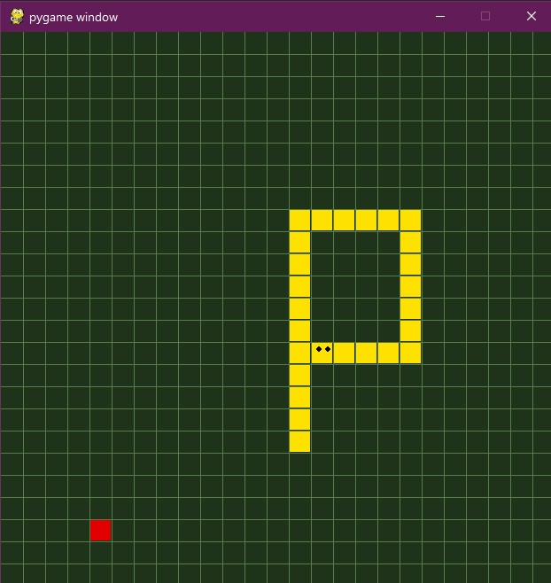

# Snake Game using PyGame
Here, I worked to create the famous snake game in python with the module pygame and Object-Oriented programming design and
implementation, and data representation.

Basic Objective of the game:
To create a Snake game that allows users to control the movement of a snake on a screen
To get points for eating food and avoiding running into the walls or the growing tail of the snake itself.

Main Modules:
1. Main game loop
2. Updating the Screen
3. Drawing the grid
4. Creating the snake
5. Updating the snake
6. Moving the snake
7. Creating the random food for snake.
8. Collision with boundary or it's own tail
9. Displaying score

